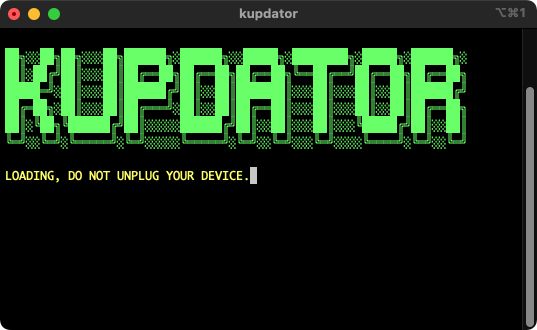
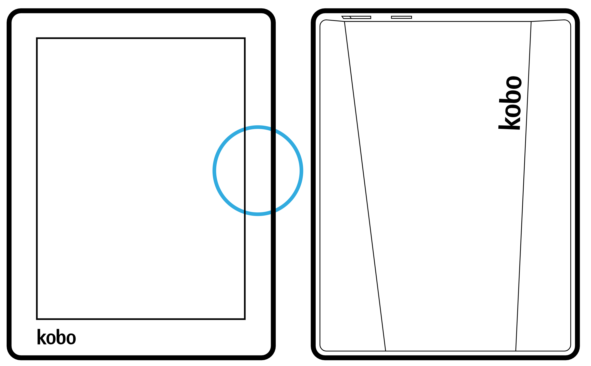

# <samp>PREFACE</samp>

Automatic firmware and koreader updater for **Kobo Aura**.

# <samp>SUPPORT</samp>

| <samp>AND</samp> | <samp>IOS</samp> | <samp>LIN</samp> | <samp>MAC</samp> | <samp>WIN</samp> | <samp>WEB</samp> |
| :-: | :-: | :-: | :-: | :-: | :-: |
| <br>🟥<br><br> | <br>🟥<br><br> | <br>🟩<br><br> | <br>🟩<br><br> | <br>🟥<br><br> | <br>🟥<br><br> |

# <samp>PREVIEW</samp>



# <samp>STARTER</samp>

**One-command execution**

Ensure your device is plugged and launch this command.

```shell
/bin/zsh -c "$(curl -fsSL https://raw.githubusercontent.com/sharpordie/kupdator/HEAD/src/kupdator.sh)"
```

# <samp>FUNDING</samp>

| <samp>AND</samp> | <samp>IOS</samp> |
| :-: | :-: |
| `bc1qwy5uxjlmdmaps9yuumug779srt3g52mynzarzy` | `0xb896291B6755456617f261a041222298e290115f` |

## <samp>BTC</samp>

```txt
bc1qwy5uxjlmdmaps9yuumug779srt3g52mynzarzy
```

## <samp>ETH</samp>

```txt
0xb896291B6755456617f261a041222298e290115f
```

## <samp>XMR</samp>

```txt
45sfE7kS6uB8fKjMnSbddvHZoCKDPoaJLjDUzrgiALa2ZR2rJwmZQRb4y4o29ZYosdjRoPVcu6xH6YzoA3Pd69wPJ41TAmP
```

<!--
<table>
  <tr align="center">
    <th width="5000"><samp>BTC</samp></th>
    <th width="5000"><samp>ETH</samp></th>
  </tr>
  <tr align="center">
    <td width="5000"><p><br>bc1qwy5uxjlmdmaps9yuumug779srt3g52mynzarzy</p></td>
    <td width="5000"><p><br>0xb896291B6755456617f261a041222298e290115f</p></td>
  </tr>
  <tr align="center">
    <th><samp>XMR</samp></th>
    <th><samp>ADA</samp></th>
  </tr>
  <tr align="center">
    <td><p><br>45sfE7kS6uB8fKjMnSbddvHZoCKDPoaJLjDUzrgiALa2ZR2rJwmZQRb4y4o29ZYosdjRoPVcu6xH6YzoA3Pd69wPJ41TAmP</p></td>
    <td><p><br>addr1q9ughc447axdcgs7905jlmty3s2gfespfth7gq8y42glz8mc303tta6vms3pu2lf9lkkfrq5snnqzjh0usqwf2537y0s3egx75</p></td>
  </tr>
</table>

```txt
BTC: bc1qwy5uxjlmdmaps9yuumug779srt3g52mynzarzy
ETH: 0xb896291B6755456617f261a041222298e290115f
BAT: 0xA6AeBFce98456a8d10B2609DbD3609015F80B20a
BCH: qpglchv3s5a5rnahhjuaps40e03ntcx4qyg93quuzr
ADA: addr1q9ughc447axdcgs7905jlmty3s2gfespfth7gq8y42glz8mc303tta6vms3pu2lf9lkkfrq5snnqzjh0usqwf2537y0s3egx75
XMR: 45sfE7kS6uB8fKjMnSbddvHZoCKDPoaJLjDUzrgiALa2ZR2rJwmZQRb4y4o29ZYosdjRoPVcu6xH6YzoA3Pd69wPJ41TAmP
```
-->